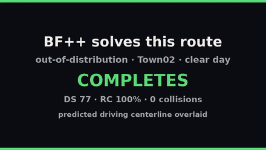
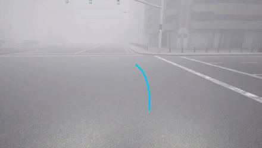
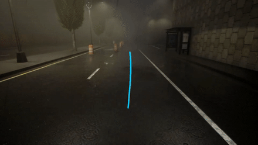

# WZPlanner

Official research repository for:

**WZPlanner: Safe End-to-End Path Planning for Autonomous Driving in Work Zones**

**Authors:** Nishad Sahu, Changzhong Qian, Guangzhou Cai, Shounak Sural, and Ragunathan (Raj) Rajkumar

**Affiliation:** Department of Electrical and Computer Engineering, Carnegie Mellon University, Pittsburgh, PA, USA

**Preprint:** arXiv

## Availability

- **WAVE:** CARLA-based tools for creating, replaying, annotating, and visualizing work-zone driving scenarios. The source and usage instructions are available in [`WAVE/`](WAVE/).
- **WorkZonePlan dataset:** Annotated simulated and real-world work-zone driving data used by WZPlanner. Public release is in preparation.
- **BoundaryFormer++ (BF++):** A method description and three closed-loop driving demonstrations are included below. BF++ implementation code and model checkpoints are available in the separate [BF++ repository](https://github.com/Nishad-Sahu/bf-plusplus-workzone) and are not included here.

The repository currently contains the WAVE release and BF++ qualitative demonstrations. Dataset download instructions and the paper citation will be added soon.

## BoundaryFormer++ (BF++)

BoundaryFormer++ predicts lane boundaries, work-zone boundaries, and a driving centerline directly from onboard sensor observations. The model supports camera-only and camera-plus-LiDAR configurations. Its predicted centerline is executed by a lightweight closed-loop controller for autonomous driving through work-zone layouts and adverse weather conditions.

### Closed-Loop Demonstrations

  
  
  

The cyan curve is the driving centerline predicted by BF++. The clear-day clip is an out-of-distribution Town02 route completed with a Driving Score of 76.7 (displayed as 77 in the clip), 100% route completion, and no collision. The storm-night clip shows the out-of-distribution Town03 barrel lane-shift route discussed in the paper; BF++ completed it with a Driving Score of 100 and no collision. The foggy-dusk clip illustrates centerline prediction under reduced visibility. In all of these cases both Simlingo and LEAD failed to complete the route and hit the construction objects or other static objects even though LEAD and Simlingo have been trained on all CARLA towns including the Town02 and Town03. BF++ was not trained on these towns but on other towns and still it performed better than Simlingo and TF++ with reduced number of parameters. 

## Citation

A machine-readable citation template is provided in [`CITATION.cff`](CITATION.cff). The arXiv identifier can be added once the preprint record is public.

## License

The source code is released under the [MIT License](LICENSE). Dataset assets may be distributed under separate terms when the WorkZonePlan download is published.
